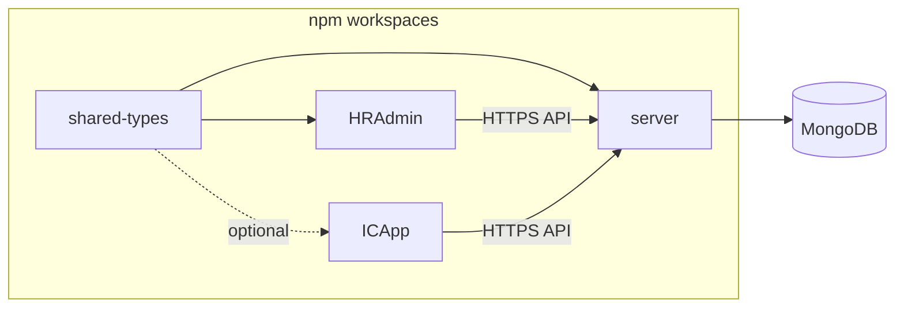

# New monorepo implementation guide (HRAdmin + ICApp)

This guide describes the **four-package** npm workspace in **this repository** (`planning-monefica`), aligned with the **Monefica** stack and application patterns. Implementation paths below point at **this repo**; for the upstream Monefica monorepo, use your company’s internal clone.

## Table of contents

1. [Goal and package map](#goal-and-package-map)
2. [Repository skeleton](#repository-skeleton)
3. [Bootstrap checklist](#bootstrap-checklist)
4. [Cross-package contracts](#cross-package-contracts)
5. [Server patterns](#server-patterns)
6. [HRAdmin (web) patterns](#hradmin-web-patterns)
7. [ICApp (mobile) patterns](#icapp-mobile-patterns)
8. [Local development matrix](#local-development-matrix)
9. [Production hosting outline](#production-hosting-outline)
10. [Tooling and AI assistant rules](#tooling-and-ai-assistant-rules)
11. [Monefica parity checklist](#monefica-parity-checklist)
12. [Dependency diagram](#dependency-diagram)

---

## Goal and package map

| Package | This repo | Stack (same family) |
|--------|-----------|---------------------|
| **server** | [`packages/server`](../../packages/server) | Node **22+**, **NestJS 11**, **Mongoose 8** / MongoDB, `env-cmd` + `.env`, Jest |
| **shared-types** | [`packages/shared-types`](../../packages/shared-types) | TypeScript-only, `tsc` → `dist/`, `package.json` **exports** (see [`EXPORTS_SETUP.md`](./EXPORTS_SETUP.md)) |
| **HRAdmin** | [`packages/hr-admin`](../../packages/hr-admin) | **Vite 8**, **React 19**, **MUI 7**, **Redux Toolkit**, **React Router 7**, **Axios**, **date-fns**, Vitest; optional Playwright E2E |
| **ICApp** | [`packages/ic-app`](../../packages/ic-app) | **Expo** + **React Native**, Android-first; RTK / React Redux, **date-fns** |

**Out of scope for the initial four packages:** a separate `ui-lib` package (Monefica has one). This repo starts with MUI inside HR Admin; extract a shared UI library later if needed.

---

## Repository skeleton

```
your-monorepo/
├── package.json                 # workspaces, root scripts
├── tsconfig.json                # solution-style references (server, shared-types, hr-admin)
├── .gitignore
├── .cursor/
│   └── rules/                   # optional: copy patterns from Monefica (see below)
├── docs/
│   └── monorepo-hr-ic/          # copy this guide into the new repo if useful
└── packages/
    ├── shared-types/
    │   ├── package.json         # name: @planning-monefica/shared-types
    │   ├── tsconfig.json        # Node16 + declaration + outDir dist (see reference)
    │   └── src/
    │       └── index.ts
    ├── server/
    │   ├── package.json
    │   ├── nest-cli.json
    │   ├── tsconfig.json
    │   └── src/
    ├── hr-admin/                # or hradmin — Vite SPA
    │   ├── package.json
    │   ├── vite.config.ts
    │   └── src/
    └── ic-app/                  # Expo app (Android focus)
        ├── package.json
        ├── app.json / app.config.*
        └── ...
```

### Root `package.json` (workspaces)

Root [`package.json`](../../package.json):

- `"workspaces": ["packages/shared-types", "packages/server", "packages/hr-admin", "packages/ic-app"]`
- Scripts such as `install:deps` (e.g. `PUPPETEER_SKIP_DOWNLOAD=1 npm install` if you add Puppeteer later), optional `start` that runs `node packages/server/dist/main.js` after build.

### TypeScript project references

Root [`tsconfig.json`](../../tsconfig.json): `references` include `packages/server`, `packages/shared-types`, and `packages/hr-admin`. **ICApp** uses Expo’s own TypeScript config and is not in the root solution graph.

---

## Bootstrap checklist

Complete in this order to avoid broken imports and CI surprises.

1. **Create the git repository** and root `package.json` with `workspaces`.
2. **Add `packages/shared-types`**
   - `tsconfig` with `module` / `moduleResolution` **Node16**, `declaration: true`, `outDir: dist`.
   - `package.json`: `main`, `types`, `exports` for the root entry and optional subpaths (see [`EXPORTS_SETUP.md`](./EXPORTS_SETUP.md)).
   - Run `npm run build` in that package and confirm `dist/` is published (or built in CI before consumers).
3. **Wire workspace dependencies**
   - In `server` and `hr-admin`, depend on `@planning-monefica/shared-types` via `file:../shared-types` (this repo) or `workspace:*` when your npm version resolves it reliably.
   - Optionally add `shared-types` as a dev dependency in `ic-app` if the mobile app imports API DTO types.
4. **Scaffold NestJS `server`**
   - `@nestjs/mongoose`, Mongoose connection from config (`MONGODB_URL` or split host/db vars).
   - Global validation pipe, versioning, CORS, and production hardening consistent with [`main.ts`](../../packages/server/src/main.ts) (helmet, `trust proxy`, origin allowlist per `ENV`).
5. **Scaffold Vite `hr-admin`**
   - Proxy `/api` to the API port (this repo: `localhost:5555` in [`vite.config.ts`](../../packages/hr-admin/vite.config.ts); align ports across `.env` and docs).
6. **Scaffold Expo `ic-app`**
   - Android dev client, env documentation (see [`ENV_SETUP.md`](../../packages/ic-app/ENV_SETUP.md), [`PROJECT_OVERVIEW.md`](../../packages/ic-app/PROJECT_OVERVIEW.md)).
7. **Local DNS / hosts**
   - Add entries similar to [CLAUDE.md](../../CLAUDE.md) (e.g. `local.hradmin.example.com` → `127.0.0.1`) and point Vite `--host` at that hostname if you need cookie/cors parity with production.
8. **CI**
   - Install → build `shared-types` → build `server` → build `hr-admin`; run tests per package. Mobile: lint/test and optional EAS build on tags.

---

## Cross-package contracts

- **Source of truth for API shapes:** `@planning-monefica/shared-types`. Controllers and DTOs on the server and request/response typing in HRAdmin (and optionally ICApp) should align with these types.
- **Build order:** any job that compiles `server` or `hr-admin` must **build `shared-types` first** (or depend on a published version).
- **Versioning:** for releases, bump `shared-types` when breaking contract changes; keep server and clients on compatible versions.

---

## Server patterns

These rules mirror Monefica’s server conventions; this repo ships Cursor rules under `.cursor/rules/`.

| Topic | Rule | Reference in this repo |
|-------|------|------------------------|
| Cross-module data access | Only through **services** of the owning module; **no** importing other modules’ Mongoose schemas/models | [`.cursor/rules/server-module-communication.mdc`](../../.cursor/rules/server-module-communication.mdc) |
| Types | All interfaces/types in **`.interface.ts`** files inside each module; no inline interfaces in services/controllers | [`.cursor/rules/server-no-inline-types.mdc`](../../.cursor/rules/server-no-inline-types.mdc) |
| Dates | Use **date-fns** for all date logic | [`.cursor/rules/use-date-fns.mdc`](../../.cursor/rules/use-date-fns.mdc) |
| Mongoose typing | Follow project typing habits | Add `packages/server/docs/MONGOOSE_TYPING_GUIDE.md` when you formalize patterns (see Monefica if available). |

**Module layout (Nest):** one domain per `*.module.ts`, colocated `schemas/`, `*.service.ts`, `*.controller.ts`, and `*.interface.ts`.

**Operational notes:** Commands and ports are in [CLAUDE.md](../../CLAUDE.md); use `npm run dev -w @planning-monefica/server`, Jest, and optional Nest REPL as needed.

---

## HRAdmin (web) patterns

| Topic | Guidance | Reference |
|-------|----------|-----------|
| Feature / page structure | Page modules: containers, components, `state/` (RTK), `services/` (HTTP) | Add `packages/hr-admin/docs/page-module-patterns.md` when you document feature layout (Monefica consultor has a reference). |
| Redux | Redux Toolkit; async reducer injection where code-splitting is needed | Same |
| Navigation UX | Use **React Router `Link`** with MUI `Button component={Link} to="..."` for route navigation (right-click / new tab) | [`.cursor/rules/hr-admin-button-navigation.mdc`](../../.cursor/rules/hr-admin-button-navigation.mdc) |
| Build output | Vite `build` → static assets (`outDir: ./build`) | [`vite.config.ts`](../../packages/hr-admin/vite.config.ts) |
| API base URL | Dev: proxy `/api` to backend; prod: env-driven API origin | `vite` `server.proxy` in [`vite.config.ts`](../../packages/hr-admin/vite.config.ts) |

---

## ICApp (mobile) patterns

| Topic | Guidance | Reference |
|-------|----------|-----------|
| Stack | Expo + React Native, **Android-first** (iOS later if needed) | [`packages/ic-app/package.json`](../../packages/ic-app/package.json) |
| Navigation | React Navigation (native stack / tabs as needed) | Add when you add navigation deps |
| State | Redux Toolkit + `react-redux` (same family as web admin) | [`App.tsx`](../../packages/ic-app/App.tsx), [`src/state/store.ts`](../../packages/ic-app/src/state/store.ts) |
| Dates | date-fns | Same as server/web |
| Config / env | Document API base URL and secrets per build profile | [`ENV_SETUP.md`](../../packages/ic-app/ENV_SETUP.md) |

**Kotlin / native-only Android:** not the Monefica pattern; only choose that if you explicitly drop parity with this stack.

---

## Local development matrix

| Package | Typical command | URL / port | Env file |
|---------|-----------------|------------|----------|
| **shared-types** | `npm run build` / `npm run dev` (tsc --watch) | N/A | N/A |
| **server** | `npm run dev` (Nest watch) | `PORT` (e.g. 5555) | `packages/server/.env` |
| **hr-admin** | `npm run start` (Vite) | 3000 (or Vite default); proxy `/api` → API | `packages/hr-admin/.env` |
| **ic-app** | `npm start` / `expo run:android` | Metro / device | `.env` / app config as per Expo |

Adjust ports in one place and reflect them in Vite proxy and mobile API config.

---

## Production hosting outline

### API (server)

- Run **`node packages/server/dist/main.js`** (or `npm run start` at repo root after `nest build`), see root [`package.json`](../../package.json) `start`.
- Set **`PORT`**, **`ENV`** (`development` | `staging` | `production`), and **MongoDB** connection string.
- Behind a reverse proxy: set **`trust proxy`** appropriately (see [`main.ts`](../../packages/server/src/main.ts)) so `X-Forwarded-*` is correct.
- **CORS:** allow only trusted web origins (and mobile deep-link origins if applicable), modeled on `originOptions` per `ENV` in `main.ts`.

### HRAdmin (static SPA)

- `vite build` → static files (e.g. `build/`).
- Serve with **`serve`** or any static host:  
  `npx serve -s build -l 3000`  
  Use **single-page app fallback** so client-side routes reload correctly (`-s` in `serve` handles this).
- Configure CDN/host headers and HTTPS to match security expectations (Monefica disables strict CSP in some setups in code — re-evaluate for your product).

### ICApp (Android)

- Release builds via **EAS Build** or CI → **Google Play** (or internal track). Document signing, package name, and API base URLs per flavor.

---

## Tooling and AI assistant rules

- **ESLint / Prettier:** per package, aligned TypeScript and React versions; optional root orchestration script.
- **Cursor / team rules:** Present in [`.cursor/rules/`](../../.cursor/rules/): `server-module-communication.mdc`, `server-no-inline-types.mdc`, `use-date-fns.mdc`, `hr-admin-button-navigation.mdc`.
- **Contributor overview:** [CLAUDE.md](../../CLAUDE.md) and [CONTRIBUTING.md](../../CONTRIBUTING.md).

---

## Monefica parity checklist

Use this when reviewing the new monorepo against this project’s standards.

- [ ] npm **workspaces** at root with four packages
- [ ] **`shared-types`**: `tsc` to `dist`, **`package.json` `exports`**, Node16 resolution
- [ ] **Server**: NestJS 11, Mongoose/MongoDB, env-based config
- [ ] **Server**: module boundaries — **services only** between modules
- [ ] **Server**: types in **`.interface.ts`** only (no inline module API types)
- [ ] **date-fns** used for dates on server, HRAdmin, and ICApp
- [ ] **HRAdmin**: Vite + React 19 + MUI + RTK + React Router
- [ ] **HRAdmin**: navigation buttons use **`Link`** / `component={Link}` where applicable
- [ ] **ICApp**: Expo + React Native, Android release path documented
- [ ] **CI**: build **shared-types** before server and web
- [ ] **Hosting**: Node API + static SPA (e.g. **serve -s**) + mobile distribution documented

---

## Dependency diagram



---

## Forking this guide

To reuse in another repository, copy `docs/monorepo-hr-ic/` and replace `@planning-monefica`, package folder names, and domains. Update [`README.md`](../../README.md) and workspace `package.json` names accordingly.